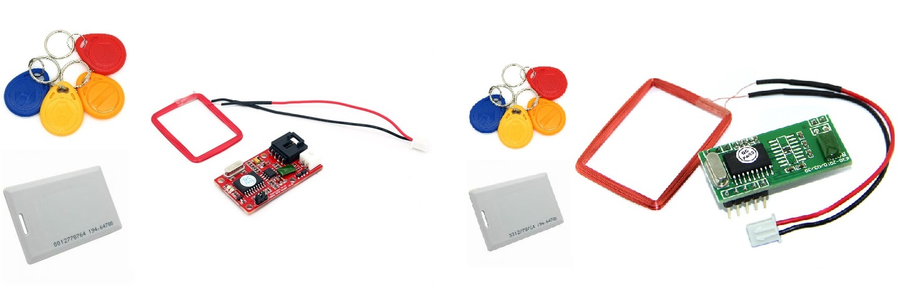
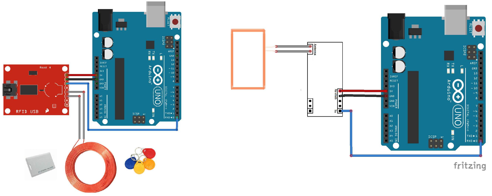

# RFID Card reader Library for Arduino
   
 
## What is it

This library (with examples) is designed to be integrated in projects using RFID Card or Tag reader.
It retrieves the card ID. It is also possible to attach your own function to be launched every time a card or tag is detected (asynchronously with interrupt).

This library has been tested with 125KHz devices but it should be usable with any kind of RFID Card reader.

## How to install

1) Download <a target="_blank" href="https://github.com/QuentinCG/Arduino-RFID-Card-Reader-Library/releases/download/1.0.0/RFIDCardReader_v1_0_0.zip">latest release</a>

2) On your Arduino IDE, click "Sketch" menu and then "Include Library > Add .ZIP Libraries"

3) You can now use the library for your project or launch an example ("File > Examples")

## How to connect the RFID Card Reader to your Arduino

RFID Card Readers have a lot of pins but only 5 are really important:

|RFID Card Reader| Arduino                      |
|--------        | --------                     |
|VCC             | 5V                           |
|GND             | GND                          |
|Tx              |Rx (For Arduino Mega, use Rx1)|

On most RFID card reader, it is also needed to attach antenna pins to your antenna.

Important note: Since Arduino Mega supports 3 UART channels, it is possible to select the one you want by changing "RFIDCardReaderPort1" to "RFIDCardReaderPort2" or "RFIDCardReaderPort3" in <a href="https://github.com/QuentinCG/Arduino-RFID-Card-Reader-Library/blob/master/RFIDCardReader.h#L20">RFIDCardReader.h</a>.

## Examples

Two examples are provided with this library:

### Check if a tag or card has been detected every second (synchronous)

<a target="_blank" href="https://github.com/QuentinCG/Arduino-RFID-Card-Reader-Library/blob/master/examples/BasicRFIDCardReader/BasicRFIDCardReader.ino">Link to source code</a>

### Show tag or card when detected (asynchronous with interrupt)
<a target="_blank" href="https://github.com/QuentinCG/Arduino-RFID-Card-Reader-Library/blob/master/examples/RFIDCardReaderWithInterrupt/RFIDCardReaderWithInterrupt.ino">Link to source code</a>

## License

This project is under MIT license. This means you can use it as you want (just don't delete the library header).

## Contribute

If you want to add more examples or improve the library, just create a pull request with proper commit message and right wrapping.
